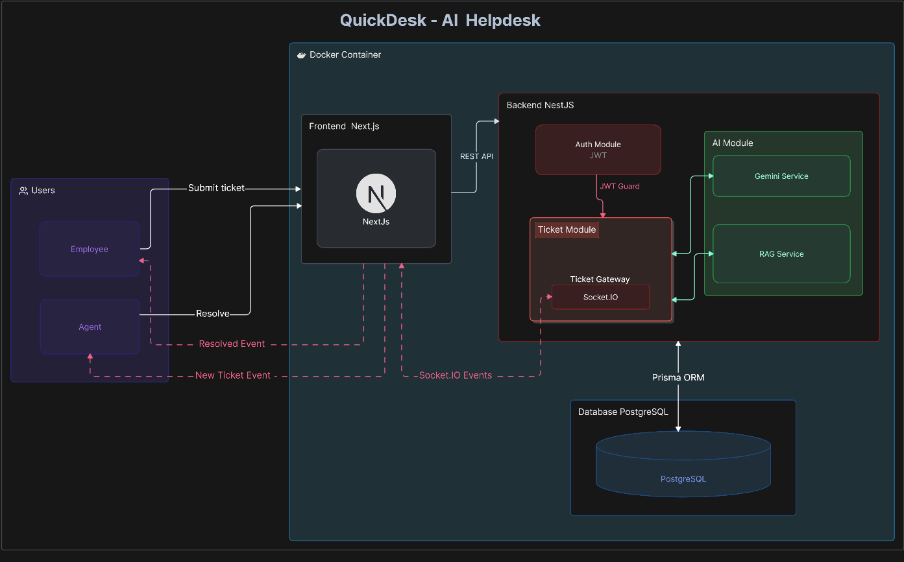

# QuickDesk AI Helpdesk

A simple internal helpdesk web app where employees can submit support tickets, and support agents can manage and resolve them. The app uses Gemini AI to automatically categorize tickets, set priority, and draft replies using a RAG pipeline based on a few markdown files.

---

## System Architecture




---

## Tech Stack
* **Frontend**: Next.js (App Router, Tailwind CSS, TypeScript)
* **Backend**: NestJS (TypeScript)
* **Database**: PostgreSQL (Prisma ORM)
* **Real-time updates**: Socket.io
* **AI/RAG**: Google Gemini API, LangChain

---

## How to run it locally
1. **Install Docker Desktop**: Ensure Docker is installed and running.
2. **Clone the repository**:
   ```bash
   git clone https://github.com/Mr-subrat-01/Quick-Desk-AI.git
   cd Quick-Desk-AI
   ```
3. **Configure Environment Variables**: Create a `.env` file in the root directory and copy the contents from `.env.example`, filling in your local configuration values.
4. **Start the application**: Run the following command inside the root directory to spin up the frontend, backend, and database containers:
   ```bash
   docker compose up
   ```
5. **Verify containers**: Wait until all containers are running successfully.
   * **Frontend**: [http://localhost:4000](http://localhost:4000)
   * **Backend API**: [http://localhost:5001](http://localhost:5001)

---

## Pre-seeded Demo Accounts
* **Agent Account**: `agent@gmail.com` | Password: `123456` 
* **Employee Account**: `emp@gmail.com` | Password: `123456`

Additional pre-seeded users can be found in the database seed file:
* `quick-desk-backend/prisma/seed.ts`

---

## API Endpoints

| Method | Path | Purpose | Auth Required | Roles Allowed |
|:---|:---|:---|:---:|:---|
| `POST` | `/api/auth/login` | Login user, set HttpOnly Refresh Cookie, return Access Token | No | All |
| `POST` | `/api/auth/refresh` | Verify HttpOnly Refresh Cookie and return new Access Token | No (Cookie) | All |
| `POST` | `/api/auth/logout` | Clear Refresh Token from DB and clear cookie | Yes | All |
| `GET` | `/api/auth/me` | Fetch current user's profile | Yes | All |
| `POST` | `/api/ticket` | Create a new ticket | Yes | `EMPLOYEE` |
| `GET` | `/api/ticket` | List of all tickets | Yes | `EMPLOYEE`(own tickets), `AGENT` (all) |
| `GET` | `/api/ticket/metrics` | Retrieve dashboard stats | Yes | `AGENT` |
| `GET` | `/api/ticket/:id` | Fetch details of a single ticket (with citations and audit logs) | Yes | `AGENT` |
| `PATCH` | `/api/ticket/:id/resolve` | Save the agent's final reply,category/priority, and mark status to resolved (stores override logs) | Yes | `AGENT` |

---

## Decisions and Tradeoffs

### a) Why did you pick this frontend framework (React vs Next.js)?
I chose Next.js because its App Router provides file-based routing, which made it simple to organize the application's pages instead of writing routing code manually. Also, Next.js layouts allowed me to cleanly split the login views from the main dashboard views.

### b) How did you structure the RAG pipeline? Chunk size, embedding model, retriever, prompt?
* **Embedding Model**: I used gemini-embedding-001. I initially tried the newer gemini-embedding-2 model, but it caused errors in my LangChain batching setup, including NaN scores and an undefined/empty vector store during the embedding process. I therefore switched to gemini-embedding-001.
* **Chunking**: I loaded the markdown files using `DirectoryLoader` and split them using a text splitter with a `chunkSize` of 700 characters and `chunkOverlap` of 100 characters to keep context intact.
* **Retriever**: I stored the embeddings in an in-memory MemoryVectorStore. I used similaritySearchWithScore to retrieve the top 3 results and applied a score threshold of 0.6 to filter out low-scoring results before passing them to the LLM.
* **Prompt**: I added strict instructions to the AI prompt to use only the provided context, avoid inventing troubleshooting steps, and return a fallback response when the retrieved context does not contain a relevant answer.

### c) How did you handle the case where the LLM returns a category that does not match your allowed list?
I defined Category and Priority enums in NestJS. When calling the Gemini API, I used Gemini's responseSchema configuration to constrain the response to valid JSON values matching my allowed enums. If the AI request fails, the backend does not store an AI-suggested category or priority. The frontend displays OTHERS and MEDIUM as default values when no AI suggestion is available.

### d) Where did you store the JWT on the client, and why?
The short-lived accessToken is stored in memory on the frontend inside lib/api.ts. Since it is not persisted in browser storage, it is cleared when the page is refreshed.

The long-lived refreshToken is stored in a secure HttpOnly cookie set by the backend, so it cannot be directly accessed by client-side JavaScript.

I also store a simple is_logged_in flag in localStorage as a UI hint. It does not contain any token or sensitive authentication data and is only used to determine whether the application should attempt authentication-related requests after a page reload or logout.

### e) How did you enforce role-based access on the backend? What stops an employee from hitting an agent-only endpoint by guessing the URL?
I used NestJS JwtAuthGuard and RolesGuard. The JwtAuthGuard verifies the JWT, and the RolesGuard checks the user's role. If an employee tries to access an agent endpoint, the backend returns `{"statusCode": 403, "message": "Access denied: Insufficient permissions"}`.


### f) Why did you pick Socket.io / WebSockets / SSE for real-time? What is the failure mode if the socket disconnects mid-session?
I chose Socket.io because it handles connection status and rooms automatically. 
* **Failure Mode**: If a user disconnects (like if they lose internet), the app keeps showing the last loaded tickets. Socket.io will try to reconnect in the background. Once connection restored, layout-level hooks automatically call `join:agents` or `join:employee` again to restore the realtime rooms.

### g) What is the worst failure mode in your system today, and what would you do to address it?
The biggest failure mode is that the document embeddings are stored in server RAM using MemoryVectorStore. If the NestJS server restarts, all embeddings are lost and the knowledge base files need to be re-embedded. Frequent restarts will affect Gemini API usage and could hit the free-tier limit.
I know this can be addressed by using a persistent vector database such as PostgreSQL with pgvector or ChromaDB, but I did not implement it because MemoryVectorStore was sufficient for the scope of this assessment.

### h) Where did AI tools help you most? Where did they hurt or mislead you?
* **Helped**: AI tools helped me quickly generate TypeScript types, database seed files, and styling layouts for UI cards.
* **Hurt/Misled**: The AI suggested using the `gemini-embedding-2` model for embeddings. Currently this model doesn't support batching in LangChain and returned empty arrays silently, which took me a lot of time to debug.
 
---

## Environment Variables
```ini
NODE_ENV=development
# port mapping
FRONTEND_PORT=4000
BACKEND_PORT=5001
# api
BACKEND_API_URL="http://localhost:${BACKEND_PORT}/api"

# database config
DB_HOST=postgres
DB_PORT=5432
POSTGRES_USER=db_username
POSTGRES_PASSWORD=db_password
DB_NAME=quickdesk
DATABASE_URL="postgresql://${POSTGRES_USER}:${POSTGRES_PASSWORD}@${DB_HOST}:${DB_PORT}/${DB_NAME}?schema=public"

# jwt config
JWT_SECRET=jwt_secret_key
JWT_ACCESS_TOKEN_EXPIRES_MIN=15
REFRESH_TOKEN_EXPIRES_IN_DAYS=7

# rate limit for employe ticket create
TICKET_LIMIT_PER_HOUR=20

#API KEY
GEMINI_API_KEY=
GEMINI_CHAT_MODEL=gemini-3.5-flash-lite
GEMINI_EMBEDDING_MODEL=gemini-embedding-001
```

## What I Would Do With More Time
- Replace MemoryVectorStore with pgvector for persistent embeddings
- Add BullMQ for reliable background AI processing with retry logic
- Add email notifications when ticket resolved and raised

## Known Issues / Limitations
* **In-Memory Vector Store**: Embeddings are stored in RAM (`MemoryVectorStore`) and are lost when the server restarts, requiring files to be re-embedded on startup.
* **JWT revocation window**: revoked users retain API access until access token expires (15 mins max)
* **Socket**: Socket reconnection restores rooms but may miss events that occurred during disconnect